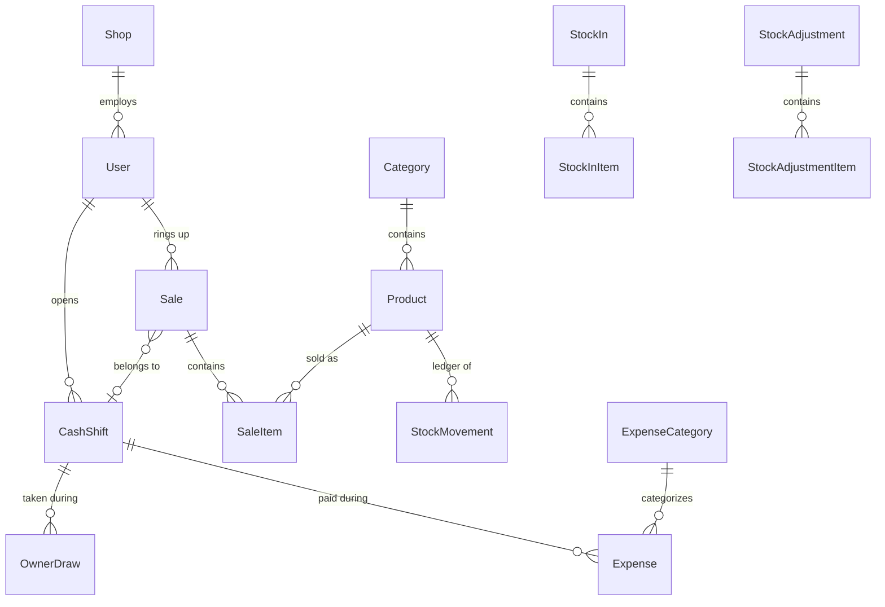

# ChumShow (ชำห่วย) — POS สำหรับร้านโชห่วยไทย

> ระบบขายหน้าร้าน + สต็อก + กำไรขาดทุน ภาษาที่คนไม่ได้เรียนบัญชีก็อ่านออก

## ทำไมร้านโชห่วยถึงเจ๊ง?

ครอบครัวผมเคยเปิดร้านโชห่วยมาก่อน และทุกวันนี้ก็ยังเห็นร้านโชห่วยอยู่เต็มไปหมด ร้านพวกนี้สู้กับ
7-Eleven, Big C Express, Lotus Express **ได้จริง** — อยู่ใกล้ลูกค้ากว่า ยืดหยุ่นกว่า เชื่อใจกันมากกว่า

แต่ที่เจ๊งกันบ่อยๆ ไม่ใช่เพราะสู้คู่แข่งไม่ได้ เป็นเพราะ:

- **เงินร้านกับเงินส่วนตัวปนกัน** — หยิบเงินในลิ้นชักไปใช้ส่วนตัวโดยไม่ได้บันทึก
- **ไม่คิดค่าแรงตัวเองและพนักงานเป็นต้นทุนจริง**
- **ไม่มีระบบสต็อก** — ขายของไปแต่ไม่รู้ว่าแต่ละชิ้นต้นทุนเท่าไหร่ กำไรจริงเท่าไหร่
- **ไม่รู้ว่าลงทุนเปิดร้านไปเท่าไหร่ (CAPEX)** และคืนทุนไปหรือยัง
- **ซอฟต์แวร์บัญชีที่มีอยู่ใช้ศัพท์ยากเกินไป** เดบิต เครดิต งบดุล — เจ้าของร้านที่ไม่ได้เรียนบัญชีมาก็งงและเลิกใช้

ChumShow เป็นโปรเจกต์ demo แบบ open-source ที่ลองแก้ปัญหาพวกนี้ตรงๆ ด้วยระบบที่:

1. **แยกเงินร้านกับเงินส่วนตัวไม่ให้ปนกันได้ตั้งแต่ระดับโครงสร้างข้อมูล** — "ค่าใช้จ่ายร้าน" กับ
   "เบิกเงินส่วนตัว" เป็นคนละตารางกันเลย ไม่มีทางบันทึกปนกันโดยไม่ตั้งใจ
2. **รู้ต้นทุนของทุกชิ้นอัตโนมัติ** ด้วยระบบต้นทุนถัวเฉลี่ยเคลื่อนที่ (weighted-average costing)
   ทุกครั้งที่รับของเข้า/ขายออก
3. **แสดงกำไรขาดทุนด้วยภาษาที่พ่อค้าแม่ค้าอ่านออก** — "ขายได้ − ต้นทุนของที่ขายไป = กำไรขั้นต้น
   − ค่าใช้จ่ายร้าน = กำไรสุทธิ" ไม่มีคำว่าเดบิต/เครดิตในหน้าจอไหนเลย
4. **เปิด-ปิดกะทุกวัน** เพื่อให้นับเงินสดในลิ้นชักตรงกับระบบ รู้ทันทีถ้าเงินขาด/เกิน
5. **รับเงินผ่านพร้อมเพย์ได้จริง** ด้วย QR ที่สร้างตามมาตรฐาน Thai QR Payment ของ ธปท. โดยไม่ต้อง
   เชื่อมต่อ API ธนาคารใดๆ

Demo นี้ตั้งใจทำให้เป็นโปรเจกต์สนุกๆ ที่อยากช่วย SME ไทย ยินดีรับ contribution และ feedback ทุกรูปแบบครับ

---

## What this is

ChumShow is an open-source demo POS + inventory + plain-language P&L system for a single Thai
โชห่วย (traditional mom-and-pop convenience store). It's built around the belief — backed by one
family's real experience running one — that these shops don't lose to 7-Eleven on convenience or
price. They lose to **operational chaos**: cash mixed with personal money, no real stock system, no
idea what anything actually costs, and accounting software too intimidating to use.

This is a demo/portfolio project, not a production SaaS — see [What's deliberately out of
scope](#whats-deliberately-out-of-scope) below.

### Core features

- **POS checkout** — product search/barcode entry, cart, Cash or PromptPay
- **Inventory with real costing** — weighted-average unit cost recomputed on every stock receipt,
  full audit ledger (`StockMovement`) for every unit that ever moved
- **Cash shift tracking (เปิดกะ/ปิดกะ)** — opening float, expected-vs-counted cash reconciliation at
  close, gates checkout so nothing gets sold outside a tracked shift
- **Expenses vs. Owner Draws kept structurally separate** — the single biggest fix for the #1 way
  these shops lose money
- **CAPEX tracking** with optional straight-line monthly depreciation (off by default)
- **Real PromptPay QR generation** (Thai QR Payment / EMVCo spec) with manual "payment received"
  confirmation — see [the PromptPay section](#promptpay-honest-limitation) below
- **Owner dashboard** — plain-Thai P&L by day/week/month, 7-day sales trend, top products, low-stock
  alerts
- **Two roles** — Owner (sees everything, including financials) and Staff (POS/stock/shift only,
  quick PIN login for a shared terminal)

---

## Tech stack

- **Next.js 16** (App Router, Server Actions, TypeScript)
- **PostgreSQL** via **Prisma 7** (driver adapter: `@prisma/adapter-pg`)
- **Auth.js v5** — Owner (password) + Staff (PIN) credentials, JWT sessions, edge-safe middleware
  split so Prisma never loads into the Edge runtime
- **Tailwind CSS v4**
- **`promptpay-qr` + `qrcode`** for real, spec-compliant PromptPay QR payloads

---

## Quick start

**Requirements:** Node.js 20+, Docker (for Postgres)

```bash
git clone https://github.com/<your-fork>/chumshow.git
cd chumshow
npm install
cp .env.example .env
npm run demo
```

`npm run demo` brings up Postgres via Docker Compose, applies migrations, seeds realistic demo data
(a shop, an Owner + a Staff account, ~12 products, a week of stock-ins/sales, an expense, an owner
draw, and two CAPEX items), and starts the dev server at **http://localhost:3000**.

**Demo logins:**

| Role  | Username  | Password / PIN |
| ----- | --------- | --------------- |
| Owner | `owner`   | `owner1234`     |
| Staff | `somchai` | PIN `1234`      |

Don't have Docker? Point `DATABASE_URL` in `.env` at any Postgres 14+ instance instead, then run:

```bash
npx prisma migrate deploy
npx prisma db seed
npm run dev
```

---

## Data model

The schema is intentionally single-shop (no multi-tenant/branch logic) and cash-basis (no general
ledger). The two decisions that matter most for the product's actual purpose:

- **`Expense` and `OwnerDraw` are separate models**, not one table with a `type` column — this makes
  it structurally impossible for a personal withdrawal to silently show up as a shop expense.
- **`SaleItem` snapshots unit price and unit cost at sale time**, so historic margin reporting never
  drifts even after today's costs change.



See [`prisma/schema.prisma`](prisma/schema.prisma) for the full model, and
[`lib/costing.ts`](lib/costing.ts) for the weighted-average engine that every stock-in, sale, and
adjustment runs through — this is the one file that, if wrong, would silently corrupt every COGS and
P&L number downstream.

---

## PromptPay: honest limitation

The PromptPay QR shown at checkout is **real** — it's a spec-compliant Thai QR Payment payload built
from the shop's own PromptPay ID, and any Thai banking app can scan and pay it correctly. No merchant
account or bank API integration required.

What it can't do is **confirm payment automatically** — that needs a paid payment-gateway
integration, which is out of scope for a demo. So the flow is: show the QR, customer pays, cashier
sees the transfer land in their own banking app, and taps "ยืนยันว่าได้รับเงินแล้ว" (confirm received).
This is genuinely how most Thai SME shops accept PromptPay today, not a corner cut for the demo.

---

## What's deliberately out of scope

| Not included | Why |
| --- | --- |
| Full accrual accounting / general ledger | This is a cash-basis operational tool for a sole proprietor, not a GL system |
| Multi-branch / multi-tenant | `Shop` is a singleton by design |
| VAT/tax compliance, e-Tax invoices | Most โชห่วย are below the VAT threshold; a real can of worms for later |
| Automatic PromptPay payment confirmation | Needs a paid bank/gateway API — see above |
| Payroll / wage calculation | `CashShift` records who worked when, but that must not be conflated with wage math |
| FIFO/lot-level costing, batch expiry tracking | Weighted-average is simpler and accurate enough for fast-moving goods |
| Supplier/AP management, purchase orders | `StockIn.supplierName` is free text only |
| Barcode scanner / receipt printer drivers | Keyboard-wedge scanners work out of the box (they just "type" into search); ESC/POS printing is a future add |
| Offline-first / PWA sync | A real need for rural connectivity, but not v1 |

---

## Development

```bash
npm run dev          # start dev server
npm run lint          # eslint
npx tsc --noEmit       # typecheck
npm run db:studio     # browse the database
npm run db:migrate    # create/apply a new migration
```

## License

MIT — see [LICENSE](LICENSE). Built as a fun project to demo how far you can get toward genuinely
helpful software for Thai SMEs with an evening's worth of focused work. PRs and forks welcome.
